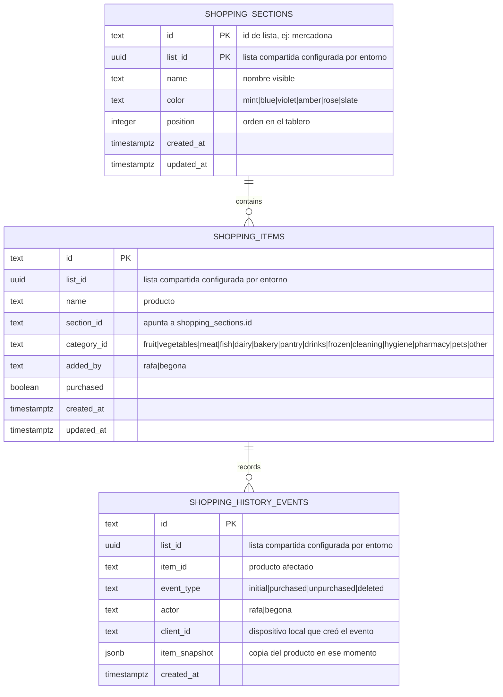

# Esquema de base de datos

Jucart guarda los datos en Supabase remoto cuando la aplicación tiene configuradas `VITE_SUPABASE_URL`, `VITE_SUPABASE_ANON_KEY` y `VITE_SUPABASE_LIST_ID`. Dexie mantiene una copia local en IndexedDB para caché y fallback.

En la interfaz se habla de "listas" porque es el lenguaje de uso. En el código y en la base de datos remota esas listas se llaman `shopping_sections`, por continuidad con el tablero original por secciones.

## Supabase



Vista operativa:

```txt
VITE_SUPABASE_LIST_ID
  |
  +-- shopping_sections
  |     - listas/columnas visibles
  |     - nombre, color y posición
  |
  +-- shopping_items
  |     - productos de esa lista compartida
  |     - section_id decide en qué lista/columna aparece cada producto
  |     - category_id decide la agrupación interna por categoría
  |     - purchased separa pendiente y comprado
  |     - added_by indica quién lo añadió
  |
  +-- shopping_history_events
        - eventos auditados de compras, devoluciones a pendiente y borrados
        - item_snapshot conserva el producto aunque se borre después
        - client_id permite distinguir cambios de otro dispositivo
```

`shopping_items.section_id` y `shopping_sections.id` se relacionan por `list_id`, pero las migraciones no declaran una foreign key. La coherencia se mantiene desde la aplicación: no se puede borrar una lista con productos y las escrituras reemplazan productos y listas de la misma `list_id`.

## IndexedDB

La base local se llama `jucart` y tiene dos tablas Dexie:

```txt
jucart
  shoppingItems
    id
    sectionId
    categoryId
    addedBy
    createdAt
    updatedAt
    purchased

  shoppingSections
    id
    position

  shoppingHistoryEvents
    id
    itemId
    type
    actor
    clientId
    createdAt
```

Al cargar, si Supabase está disponible, la aplicación lee datos remotos y actualiza IndexedDB. Si Supabase no está configurado o falla, usa IndexedDB como almacenamiento local.

## Migraciones

- `supabase/migrations/20260713190304_create_shopping_items.sql`: crea `shopping_items`, índices, `updated_at`, RLS y Realtime.
- `supabase/migrations/20260714044000_create_shopping_sections.sql`: crea `shopping_sections`, migra las secciones iniciales y activa RLS/Realtime.
- `supabase/migrations/20260714053500_add_shopping_section_colors.sql`: añade `color` a las listas.
- `supabase/migrations/20260714055000_add_shopping_item_categories.sql`: añade `category_id` a los productos.
- `supabase/migrations/20260715120000_create_shopping_history_events.sql`: crea `shopping_history_events`, añade índices de consulta por lista/fecha y activa RLS/Realtime.
